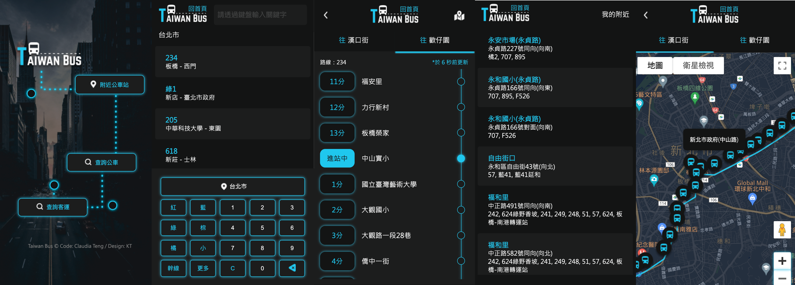

# 作品說明

The F2E 全台公車動態時刻查詢應用服務

- 搜尋指定公車路線的站序資料、預估時間
- 搜尋附近站牌及路線資料
- 地圖模式檢視公車路線站牌位置
- 收藏常用路線（目前使用 local storage）
- 手機、平板、電腦皆可使用

Data source: [TDX 運輸資料流通服務](https://tdx.transportdata.tw/)

Design: [KT](https://www.behance.net/KT_Designer)

# 系統說明

專案運行方式：`ng serve`

# 資料夾說明

`src/app`:

- auth：利用 intercepter 處理 http request header
- components：主要分為 index（首頁）, city-bus（公車）, nearby（附近站牌）, my-fav（收藏路線）
- model：存放所有 interface
- service：存放所有 service

# 使用技術

- Angular
- Sass
- PrimeNG
- CSS Flexbox
- CSS Grid
- RWD

# 第三方服務

- Google Maps

---

# Project Description

The F2E Taiwan Real-time Bus Tracker Application

- Search for specific bus routes, including stop order and estimated arrival times.
- Find nearby bus stops and route information.
- View bus stop locations on a map.
- Save favorite routes (currently using local storage).
- Responsive design for use on mobile, tablet, and desktop.

Data Source: TDX Transport Data eXchange (https://tdx.transportdata.tw/)

Design: [KT](https://www.behance.net/KT_Designer)

# System Instructions

How to Run the Project: `ng serve`

# Folder Structure

`src/app`:

- auth: Handles HTTP request headers using an interceptor.
- components: Main components include index (Homepage), city-bus (Bus), nearby (Nearby Stops), and my-fav (Favorite Routes).
- model: Stores all interfaces.
- service: Stores all services.

# Tech Stack

- Angular
- Sass
- PrimeNG
- CSS Flexbox
- CSS Grid
- RWD (Responsive Web Design)

# Third-Party Services

Google Maps
